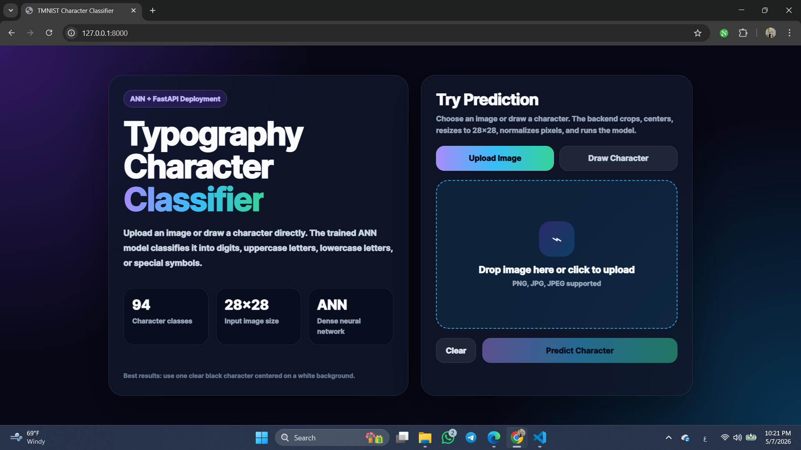
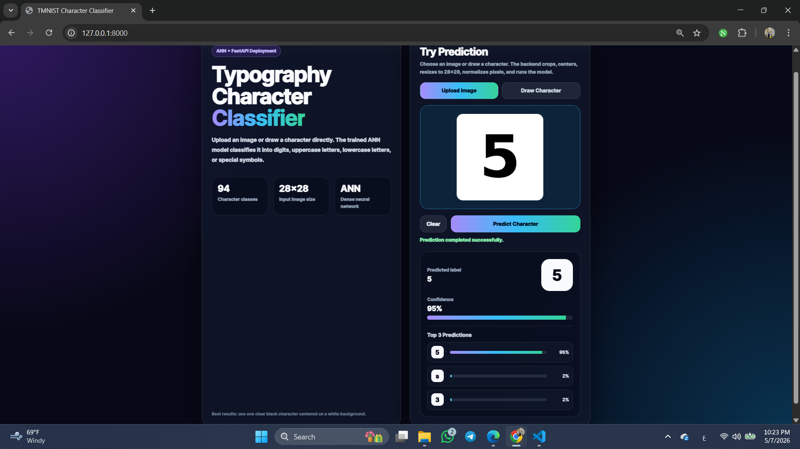
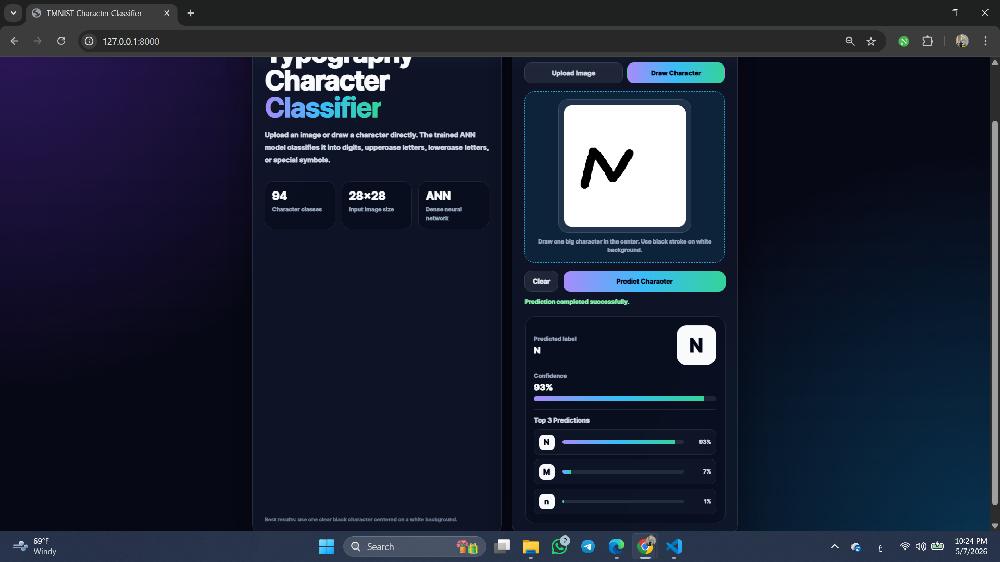
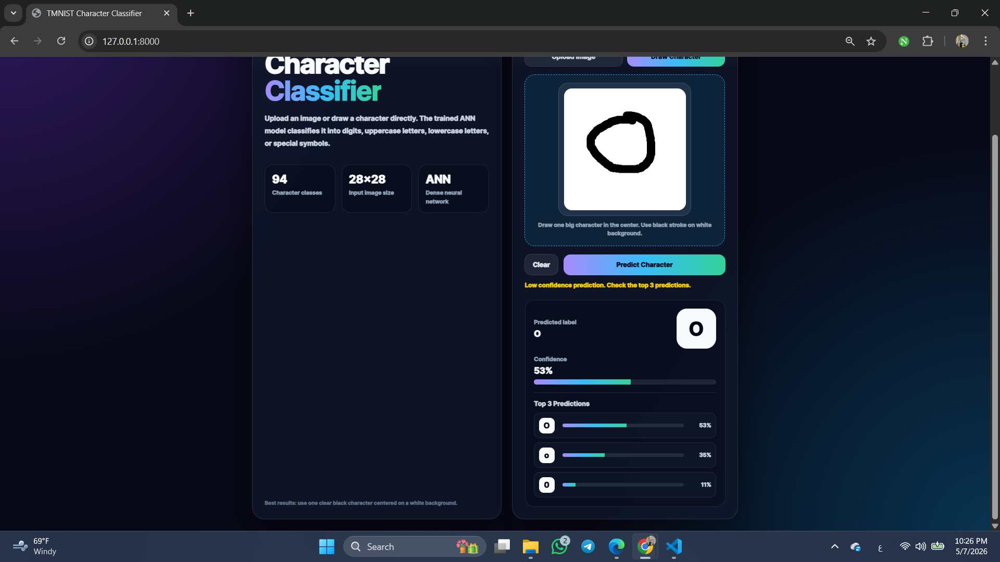

# Typography Character Classifier using ANN + FastAPI

A complete machine learning project for classifying typographic characters from grayscale images.

The model is trained on the TMNIST Alphabet dataset and deployed using FastAPI. The app supports both image upload and drawing a character directly in the browser.

---

## Project Objective

The goal of this project is to build, train, evaluate, and deploy an Artificial Neural Network (ANN) that can classify character images into one of 94 classes:

- Digits
- Lowercase letters
- Uppercase letters
- Special symbols

---

## Demo

### Home Page


### Upload Prediction


### Draw Prediction


### Top 3 Predictions


---

## Kaggle Notebook

The training notebook is also available on Kaggle:

[View Kaggle Notebook](https://www.kaggle.com/code/mlnagy/tmnist-ann-character-classifier)

---

## Dataset

The project uses the **TMNIST Alphabet (94 characters)** dataset from Kaggle.

Dataset link:

[TMNIST Alphabet 94 Characters Dataset](https://www.kaggle.com/datasets/nikbearbrown/tmnist-alphabet-94-characters)

Dataset structure:

| Column | Description |
|---|---|
| `names` | Font style name |
| `labels` | Target character |
| `1` to `784` | Grayscale pixel values from 0 to 255 |

Each image is represented as a flattened `28 × 28` grayscale image, so each sample has `784` pixel values.

---

## Project Pipeline

### 1. Data Preprocessing

The CSV file is loaded using Pandas.

Preprocessing steps:

- Separate features `X` and labels `y`
- Normalize pixel values from `0–255` to `0–1`
- Encode labels using `LabelEncoder`
- Split the data into:
  - Training set
  - Validation set
  - Test set

Since the labels were encoded as integer values using `LabelEncoder`, the model uses:

```text
sparse_categorical_crossentropy
```

If one-hot encoding was used instead, `categorical_crossentropy` would be the suitable loss function.

---

### 2. ANN Model Architecture

The model is a fully connected neural network.

Architecture:

```text
Input Layer: 784 neurons
Dense Layer: 512 neurons + ReLU
Dropout: 0.3
Dense Layer: 256 neurons + ReLU
Dropout: 0.3
Output Layer: 94 neurons + Softmax
```

The output layer has `94` neurons because the dataset contains `94` character classes.

---

### 3. Model Training

Training setup:

| Item | Value |
|---|---|
| Optimizer | Adam |
| Loss | Sparse Categorical Crossentropy |
| Metric | Accuracy |
| Epochs | 10 |
| Batch size | 256 |

Validation data was used during training to monitor model performance and detect overfitting or underfitting.

---

### 4. Model Evaluation

The model was evaluated using:

- Test accuracy
- Classification report
- Confusion matrix
- Top confusion pairs

Final result:

```text
Validation Accuracy: ~89.99%
Test Accuracy: ~90.01%
Test Loss: ~0.3065
```

Most common mistakes were between visually similar characters, such as:

```text
w / W
X / x
V / v
c / C
O / 0 / o
I / l / |
- / _
```

This is expected because many characters look very similar in different font styles.

---

### 5. Visualization

The notebook includes plots for:

- Training vs Validation Accuracy
- Training vs Validation Loss

These plots help check whether the model is improving normally, overfitting, or underfitting.

---

### 6. Prediction System

The prediction system:

1. Takes an image
2. Converts it to grayscale
3. Crops and centers the character
4. Resizes it to `28 × 28`
5. Normalizes pixel values
6. Flattens it to `784` values
7. Predicts the class
8. Converts the predicted index back to the original character

The label mapping is saved in:

```text
models/label_classes.npy
```

---

### 7. FastAPI Deployment

The model is deployed using FastAPI.

The API contains:

| Endpoint | Method | Description |
|---|---|---|
| `/` | GET | Opens the frontend |
| `/predict` | POST | Receives an image and returns prediction |
| `/health` | GET | Simple health check |

The `/predict` endpoint returns JSON:

```json
{
  "predicted_label": "A",
  "confidence": 0.92,
  "top_predictions": [
    {
      "label": "A",
      "confidence": 0.92
    }
  ]
}
```

---

## Frontend Features

The project includes a single-page frontend built with HTML, CSS, and JavaScript.

Features:

- Upload an image
- Draw a character using canvas
- Preview the input
- Show predicted label
- Show confidence score
- Show top 3 predictions
- Show low-confidence warning

The drawing feature is added as a bonus. The model was trained on typographic font-based characters, so uploaded printed characters usually perform better than hand-drawn input.

---

## Project Structure

```text
typography-character-classifier/
│
├── app/
│   ├── main.py
│   └── index.html
│
├── models/
│   ├── tmnist_ann_model.keras
│   └── label_classes.npy
│
├── notebook/
│   └── tmnist_ann_training.ipynb
│
├── sample_inputs/
│   ├── sample_5.png
│   ├── sample_A.png
│   ├── sample_W.png
│   └── sample_question_mark.png
│
├── screenshots/
│   ├── 01_home_page.png
│   ├── 02_upload_prediction.png
│   ├── 03_draw_prediction.png
│   └── 04_top3_predictions.png
│
├── requirements.txt
├── .gitignore
├── LICENSE
└── README.md
```

---

## How to Run the Project

### 1. Clone the repository

```bash
git clone https://github.com/Nagy-API/typography-character-classifier.git
cd typography-character-classifier
```

### 2. Create a virtual environment

```bash
python -m venv venv
```

### 3. Activate the environment

On Windows PowerShell:

```bash
venv\Scripts\activate
```

If PowerShell blocks activation, run:

```bash
Set-ExecutionPolicy -Scope Process -ExecutionPolicy Bypass
venv\Scripts\activate
```

### 4. Install requirements

```bash
pip install -r requirements.txt
```

### 5. Start the FastAPI server

```bash
uvicorn app.main:app --reload
```

### 6. Open the app

Open this URL in your browser:

```text
http://127.0.0.1:8000
```

---

## Sample Inputs

The repository includes a few sample images inside:

```text
sample_inputs/
```

These images can be used to quickly test the upload prediction feature.

---

## Important Notes

Do not upload these files or folders to GitHub:

```text
venv/
data/
kaggle.json
__pycache__/
```

The dataset is not included in the repository because it is large. It can be downloaded from Kaggle.

---

## Technologies Used

- Python
- Pandas
- NumPy
- TensorFlow / Keras
- Scikit-learn
- Matplotlib
- Seaborn
- FastAPI
- Uvicorn
- Pillow
- HTML
- CSS
- JavaScript

---

## Limitations

The model was trained on typographic characters generated from fonts, not handwritten characters.

Because of that, hand-drawn characters may have lower confidence than uploaded printed characters.

---

## Future Improvements

Possible improvements:

- Replace the ANN with a CNN for better image feature extraction
- Add more handwritten-like samples
- Add data augmentation
- Deploy the API online
- Add Docker support
- Improve preprocessing for hand-drawn characters

---

## Author

**Nagy**
